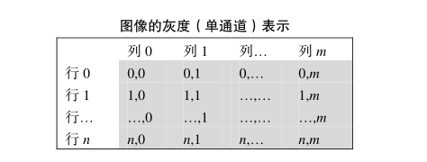

# 通道

> 在Photoshop中有一个很重要概念叫图像通道，在RGB色彩模式下就是指那单独的红色、绿色、蓝色部分。也就是说，一幅完整的图像，是由红色绿色蓝色三个通道组成的。他们共同作用产生了完整的图像。

在计算机时代，为了定量的描述某种颜色，人们设计了许多不同的性质和用途的颜色空间：

- HSL（HSV、HSB）色彩空间，是将颜色分出「色相」「饱和度」和「亮度（明度）」三个分量
- CMYK 色彩空间，是将颜色分出「青色」「品红」「黄」「黑」四个分量
- Lab 色彩空间，是将颜色分出「亮度」「a」「b」三个分量
- RGB 色彩空间，是将颜色分出「红色」「绿色」「蓝色」三个分量

> **颜色的分量，就是「通道」。**

**单通道**：俗称灰度图，每个像素点只能有有一个值表示颜色，它的像素值在0到255之间，0是黑色，255是白色，中间值是一些不同等级的灰色。

> **Alpha**通道是计算机图形学中的术语，指的是特别的通道，意思是“非彩色”通道，主要是用来保存选区和编辑选区。

- 
  Alpha 没有透明度的意思，不代表透明度。opacity 和 transparency 才和透明度有关，前者是不透明度，后者是透明度。比如 css 中的「opacity: 0.5」就是设定元素有 50% 的不透明度。
- 一个图像的每个像素都有 RGB 三个通道，后来 [Alvy Ray Smith](http://en.wikipedia.org/wiki/Alvy_Ray_Smith) 提出每个像素再增加一个 Alpha 通道，取值为0到1，用来储存这个像素是否对图片有贡献，0代表透明、1代表不透明。也就是说，Alpha 通道储存一个值，其外在表现是透明度，Alpha 和透明度没啥关系。
- 为什么取名为 Alpha 通道，我觉得是因为这是除RGB以外「第一个通道」的意思，没有别的更深刻的含义。
- Alpha 通道是图片内在的一个属性，用 css 或者其他外部方法设定透明度，并没有改变图片的 Alpha 通道的值。

