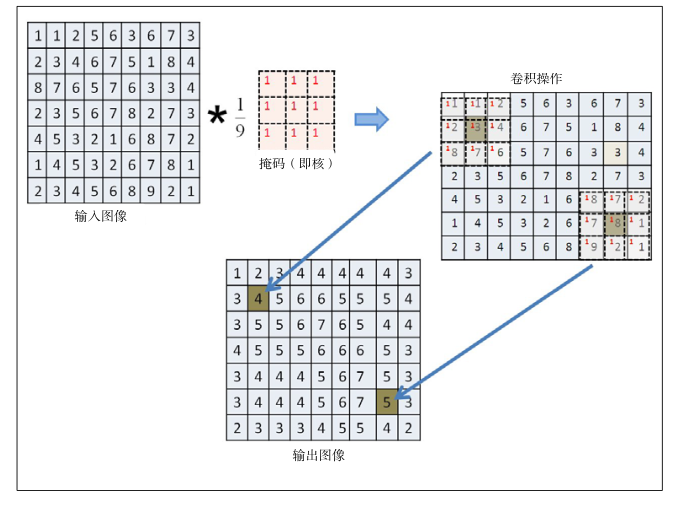
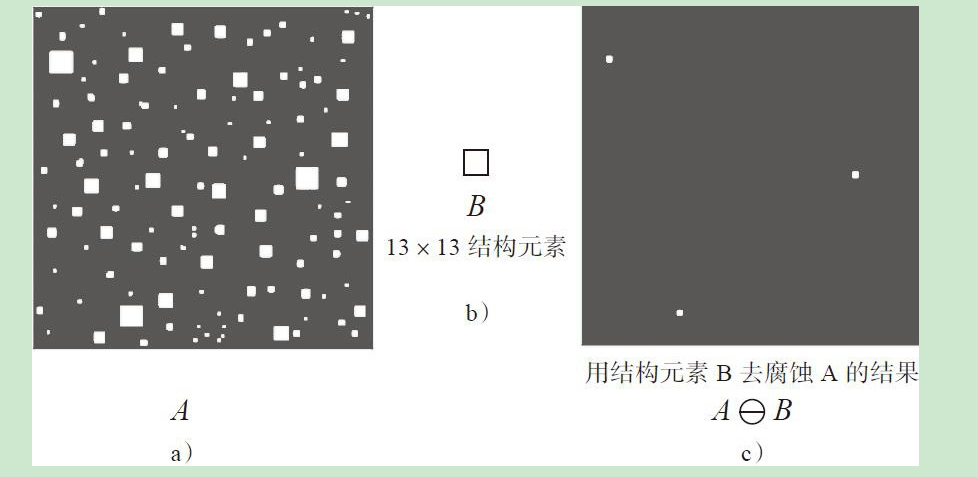

# 图像处理

### 卷积基本概念

*卷积是用于线性滤波的最常见操作之一，卷积核中的数值是对应像素做乘法运算的系数。最终结果保存在锚点。*



### 模糊

> 图像的信息越丰富，意味着对于相同的操作，该图像所耗费的的计算时间比包含信息少的图像更长。为了解决这个问题，我们要做模糊处理。

##### 均值模糊

*卷积核的所有系数都相同，这种基于相同系数的卷积核完成的卷积操作又称为均值模糊，均值模糊最主要的作用是可以降低图像的噪声、模糊图像、降低图像的对比度*

```
blur(Mat src, Mat dst, Size ksize, Point anchor, int borderType)
```

##### 高斯模糊

```java
GaussianBlur(Mat src, Mat dst, Size ksize, double sigmaX, double sigmaY, int borderType)
```

### 统计排序滤波

##### 中值滤波

*中值滤波同样也需要一个卷积核，与卷积滤波不同的是，它不会用卷积核的每个系数与对应的像素值做算术计算，而是把对应的像素值做排序，取中间值作为输出*


```
medianBlur(Mat src, Mat dst, int ksize)
```

##### 最大值滤波

```
dilate(Mat src, Mat dst, Mat kernel) 
```

##### 最小值滤波

```
erode(Mat src, Mat dst, Mat kernel) 
```

### 边缘保留滤波

##### 高斯双边滤波

*高斯双边滤波是在高斯滤波的基础上进一步拓展与延伸出来的图像滤波方法，blur操作是图像均值模糊，会导致图像出现轮廓与边缘消失的现象，而高斯模糊则会产生类似于毛玻璃的效果，导致边缘扩展效应明显、图像边缘细节丢失的问题。双边滤波器（Bilateral Filter）可以在很好地保留边缘的同时，抑制平坦区域图像的噪声。双边滤波器能做到这些的原因在于它不像普通的高斯/卷积低通滤波，其不仅考虑了位置对中心像素的影响，还考虑了卷积核中像素与中心像素之间相似程度的影响*

```
bilateralFilter(Mat src, Mat dst, int d, double sigmaColor, double sigmaSpace)
```


##### 均值滤波

*均值迁移滤波主要是通过概率密度估算与中心迁移的方式来实现图像边缘保留滤波，其基本原理是通过创建大小指定的卷积核窗口，搜索并计算该窗口中心像素P（x，y）范围内所有满足条件的像素，计算它们的中心位置，然后基于新中心位置再次计算更新，直到中心位置不再变化或者两次变化的中心的距离满足指定的收敛精度值为止。*

```
pyrMeanShiftFiltering(Mat src, Mat dst, double sp, double sr, int maxLevel, TermCriteria termcrit)
```


### 自定义滤波

```
filter2D(Mat src, Mat dst, int ddepth, Mat kernel)
```

### 形态学操作

##### 腐蚀与膨胀

膨胀与腐蚀是最基本的图像形态学操作，与卷积计算类似，其也需要一个类似卷积核的结构元素，与输入图像像素数据完成计算，腐蚀与膨胀的常见操作对象主要是二值图像或者灰度图像，OpenCV所有的形态操作都可以扩展到彩色图像，而腐蚀与膨胀扩展到彩色图像就是前面提到的图像最小值与最大值滤波。




##### 开闭操作

开操作有点像腐蚀操作，主要是用来去除小的图像噪声或者图像元素对象黏连，开操作可定义为一个腐蚀操作再加上一个膨胀操作，两个操作使用相同的结构元素

闭操作有点像膨胀，但是它与膨胀不同，它只会填充小的闭合区域，闭操作可定义为一个膨胀操作再接一个腐蚀操作


##### 顶帽与黑帽

顶帽与黑帽操作是由形态学的开闭操作之后的结果与原图进行运算得到的结果，用于在灰度图像或者显微镜图像上分离比较暗或者明亮的斑点


##### 梯度

图像的形态学梯度又称为基本梯度，是通过最基本的两个形态学操作膨胀与腐蚀之间的差值得到的


```
morphologyEx(src, dst, Imgproc.xxx, k);
```

### 阈值化

对于彩色或者灰度图像，可以设置多个或者一个阈值，使用它们就可以实现对图像像素数据的分类，这在图像处理上有一个专门的术语——图像分割。对灰度图像来说，图像分割本质上就是图像阈值化的过程。

图像二值化处理也叫图像阈值化处理，针对图像的统计特性，通过设定某个阈值并以此为门限，把多灰度级图像变成仅有两个灰度级的黑白图像的处理过程。

阈值化类型：阈值二值化、反阈值二值化、阈值截断、阈值取零和反阈值取零

```
threshold(Mat src, Mat dst, double thresh, double maxval, int type)
```

```
adaptiveThreshold(Mat src, Mat dst, double maxValue, int adaptiveMethod, int thresholdType, int blockSize, double C) //自适应阈值
```

