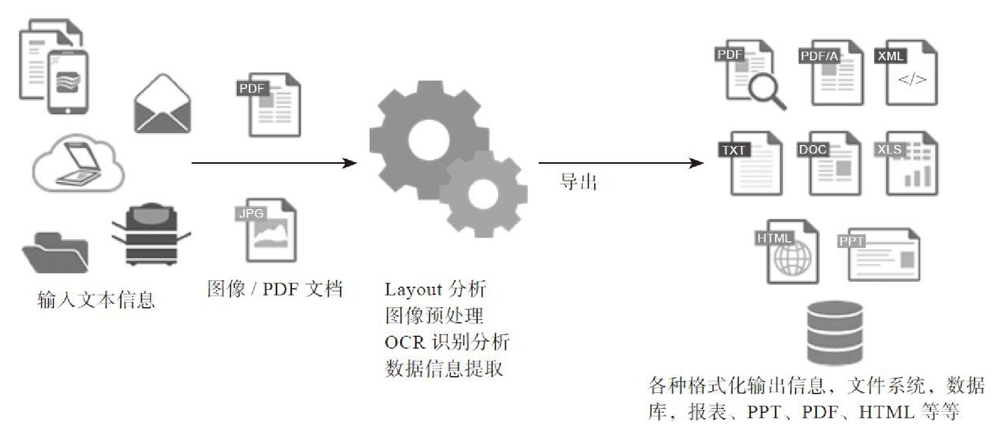

# ORC识别

*OCR是（Optical Character Recognition）光学字符识别的缩写，是通过扫描等光学输入方式将各种纸质的书籍、资料、文件及其他印刷品的文字转化为图像信息，再利用文字识别技术将图像信息转化为可以使用的数据信息（计算机可以识别的字符串、数字等）。简单点说就是从图像中识别出文本与数字，转换为可以使用的数据信息，是一种以图像处理、机器学习/深度学习为基础的在图像中提取文本的技术。*

