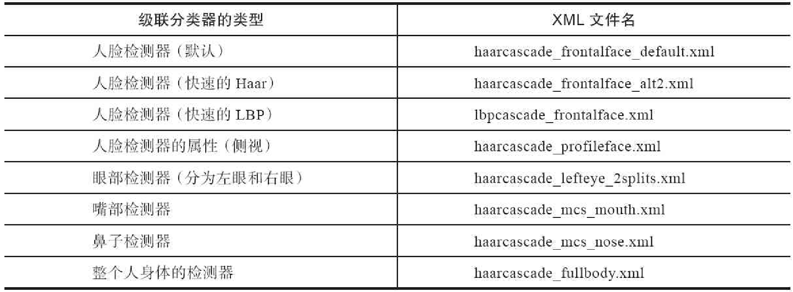

## OpenCV FOR Face Recognition

Haar检测器和LBP检测器



OpenCV 自带的LBP人脸检测器与Harr人脸检测器相比不太稳定，因此，若需要更稳定的人脸检测器，读者可自己训练LBP人脸检测器或使用Harr人脸检测器

```
EigenFaceRecognizer_create() 
# 特征脸，也称为PCA，首先由Turk和Pentland于1991年提出的

LBPHFaceRecognizer_create() 
#局部二值模式直方图（Local Binary Pattern Histograms，LBPH），由Ahonen、Hadid和Pietik inen于2004年提出的

FisherFaceRecognizer_create() 
# Fisher脸，也称为LDA，由Belhumeur、Hespanha和Kriegman于1997年提出的
```

