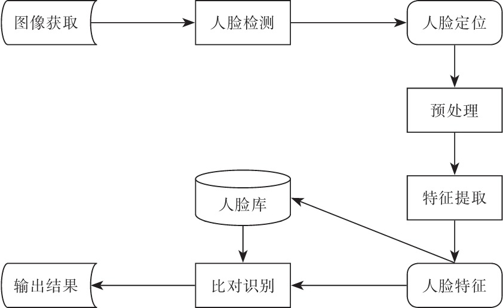

# 人脸识别

广义的人脸识别实际包括构建人脸识别系统的一系列相关技术，包括人脸图像采集、人脸定位、人脸识别预处理、身份确认以及身份查找等；而狭义的人脸识别特指通过人脸进行身份确认或者与身份查找相关的技术或系统。
人脸识别是一个热门的计算机技术研究领域，它属于生物特征识别技术，是用生物体(一般特指人)本身的生物特征来区分生物个体。生物特征识别技术所研究的生物特征包括脸、指纹、手掌纹、虹膜、视网膜、声音(语音)、体形、个人习惯(例如敲击键盘的力度、频率、签字)等，相应的识别技术就有人脸识别、指纹识别、掌纹识别、虹膜识别、视网膜识别、语音识别(可以进行身份识别，也可以进行语音内容的识别，只有前者属于生物特征识别范畴)、体形识别、键盘敲击识别、签字识别等。

