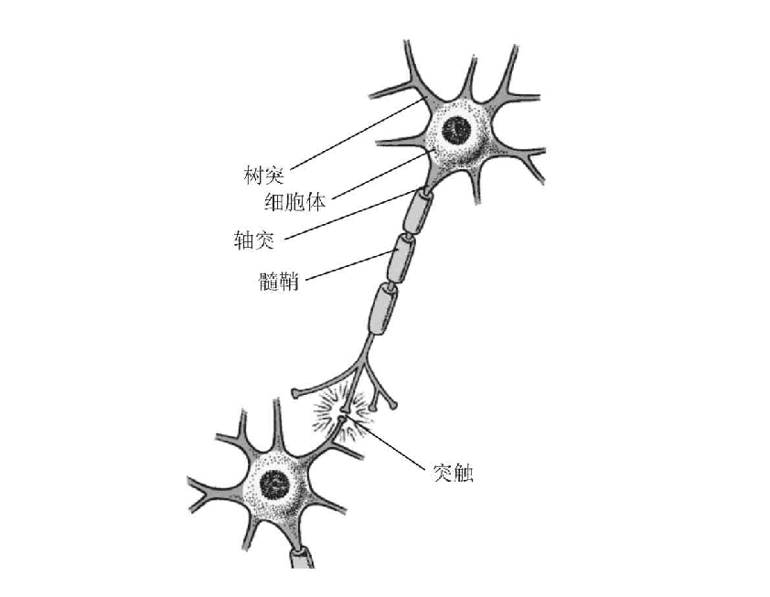

# 神经网络

神经网络(Neural Network)或者人工神经网络(Artificaial Neural Network ,ANN)是一种模仿动物神经网络行为特征，进行分布式并行信息处理的算法数学模型。神经网络依靠系统的复杂程度，通过调整内部大量节点之间相互连接的关系，从而达到处理信息的目的。

**神经网络是一种人类由于受到生物神经细胞结构启发而研究出的一种算法体系**

### 历史发展

一般我们可以把神经网络的发展历史分成4个时期：

- 启蒙时期（1890-1969）

  - 1940s 神经网络被提出
  - 1958年，计算机学家Rosenblatt提出了一种具有三层网络特性的神经网络结构，称为“感知器”
  - 1960s 深度神经网络被提出

- 低潮时期（1969-1982）

  - 1969年，人工智能的创始人之一的Minsky和Papert出版了一本名为《感知器》的书，书中指出简单神经网络只能运用于线性问题的求解，能够求解非线性问题的网络应具有隐层，而从理论上还不能证明将感知器模型扩展到多层网络是有意义的

- 复兴时期（1982-1986）

  - 1982年，美国加州理工学院的优秀物理学家Hopfield提出了Hopfield神经网络。Hopfield神经网络引用了物理力学的分析方法，把网络作为一种动态系统并研究这种网络动态系统的稳定性

  - 1985年，Hinton和Sejnowski借助统计物理学的概念和方法提出了一种随机神经网络模型——玻尔兹曼机。

    一年后他们又改进了模型，提出了受限玻尔兹曼机。

  - 1986年，Rumelhart，Hinton，Williams发展了BP算法

- 新时期（1986至今）

  - 2006年深度学习的理念正式被提出
  - 2016年AlphaGo的出现把深度学习推向了一个新的高度

### 重要人物

- Geoffrey Hinton

  - 英国出生的计算机学家和心理学家，以其在神经网络方面的贡献闻名。Hinton是反向传播算法和对比散度算法的发明人之一，也是深度学习的积极推动者。目前担任多伦多大学计算机科学系教授。

- Yann LeCun

  - 计算机科学家，他最著名的工作是光学字符识别和计算机视觉上使用卷积神经网络（CNN），他也被称为卷积网络之父。

- Yoshua Bengio

  - 毕业于麦吉尔大学，在MIT和贝尔实验室做过博士后研究员，自1993年之后就在蒙特利尔大学任教。在预训练问题，自动编码器降噪等领域做出重大贡献。

- Andrew Wu(吴恩达)

  