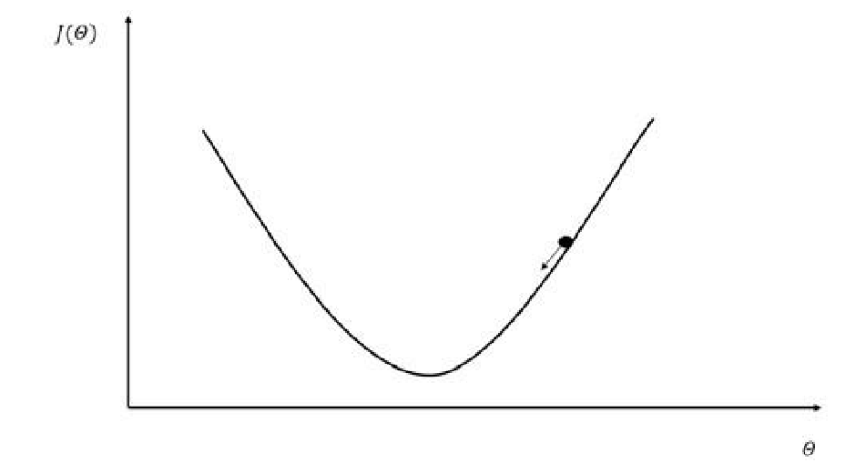
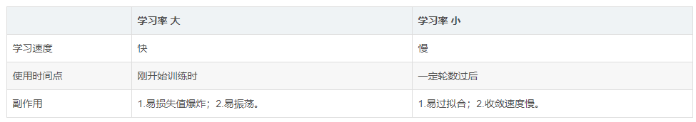
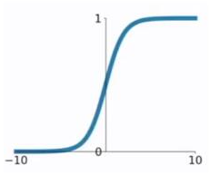
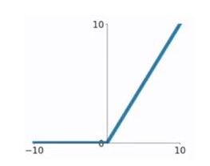
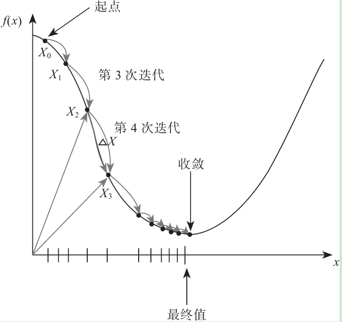
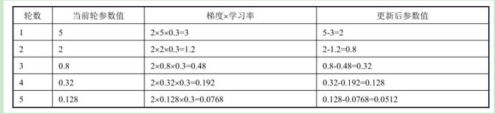

# 一个简单的神经网络

### Tensorflow游乐场

http://playground.tensorflow.org

### 概念与名词解释

- LAYER

  - HIDDEN LAYERS
    - 隐藏层
    - 输入层
    - 输出层
  - FEATURES
    - 输入数据方式
  - NEURON
    - 神经元
    - Bias
      - 偏置值
    - Weight
      - 权重

- DATA

  - TEST DATA
    - 测试数据占比
  - Noise
    - 噪音
  - Batch Size
    - 批次数量

- OUTPUT

  - Loss

    - 损失（代价）函数
    - 来描述拟合与真实观测的差异，是用来衡量人工神经网络（ANN）的预测值与实际值的一种方式
    - 种类
      - 二次代价函数
      - 交叉熵代价函数
      - 对数似然损失函数
      - ....

  - Test Loss

    - 测试数据Loss

  - Training Loss

    - 训练数据Loss

  - 拟合

    

    - 欠拟合
    - 过拟合
      - 过拟合是指为了得到一致假设而使假设变得过度严格
      - 表现为在训练数据上有很低的Loss,但在测试数据上有很高的Loss
      - 防止过拟合的方法
        - 增大数据集
        - 正则化
        - Dropout

- PARAMS

  - Epoch

    - 训练次数

  - Learning rate

    - 学习率

      

      

  - Activation

    - 激活函数

      - 激活函数是神经网络的一个重要组成部分。如果不用激活函数（即相当于激活函数为f(x)=x），在这种情况下，网络的每一层的输入都是上一层的线性输出，因此，无论该神经网络有多少层，**最终的输出都是输入的线性组合**，与没有隐藏层的效果相当，这种情况就是最原始的感知机。

      - Sigmoid

        

      - tanh

        

      - ReLU

        

      - Linear

      - softmax

  - Regularization

    - 正则化
      - 损失函数里，加入对每个参数的惩罚度
      - L2
      - L1

  - Regularizateion rate

    - 正则化率

  - Problem type

    - 问题类型

  - 核心算法

    - 前向传播算法

      

    - 优化算法

      - 反向传播算法

        

        - 梯度下降算法

          梯度下降法是一种致力于找到函数极值点的算法，在机器学习中，我们一般通过这种方法获取模型参数，从而求得目标函数或代价函数的极值

          

      

      ​			

      

      

      ​		

      