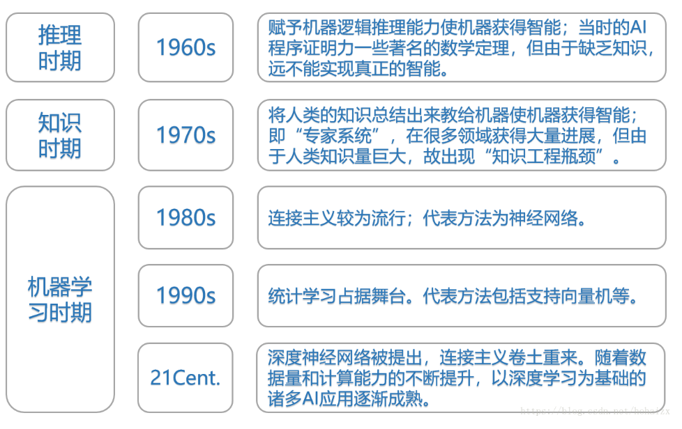
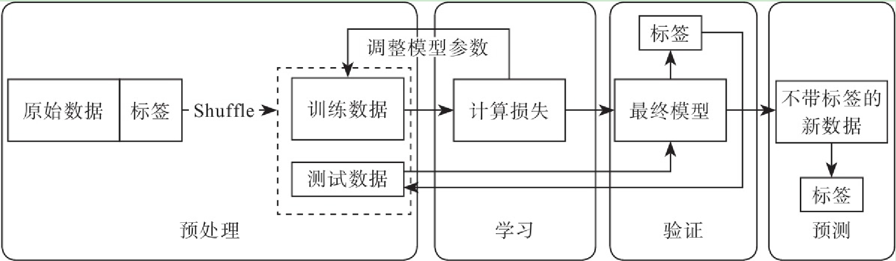
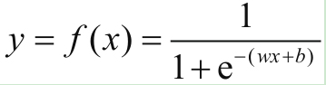
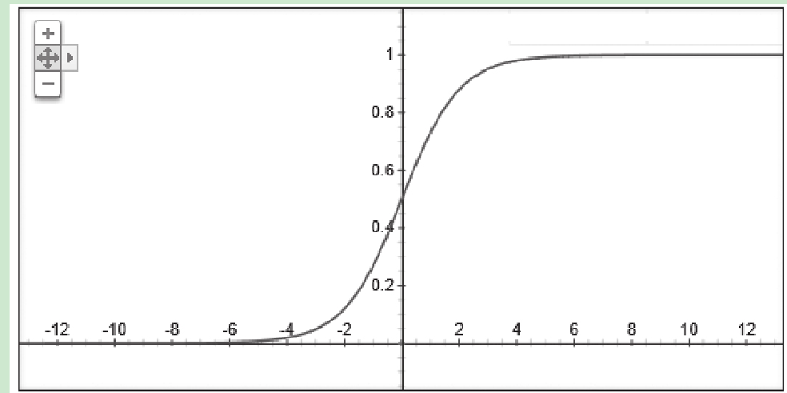
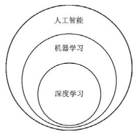
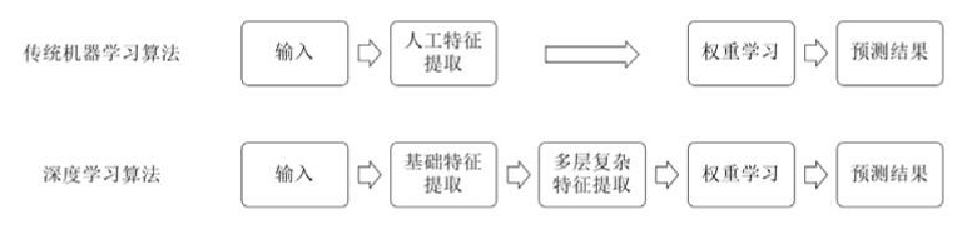
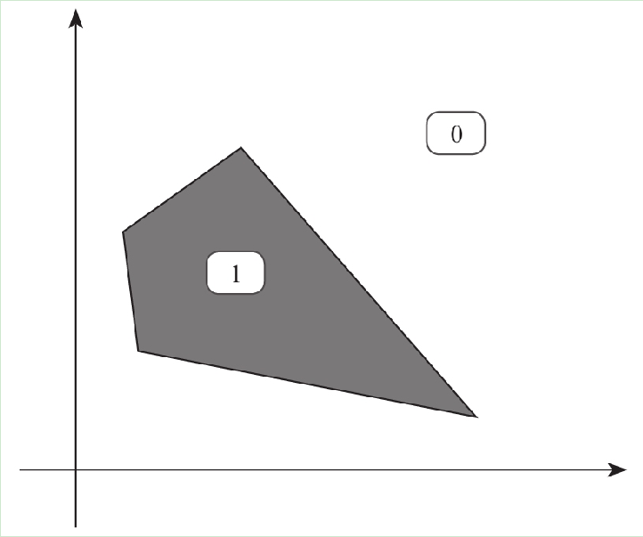
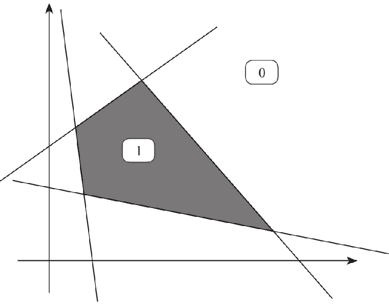
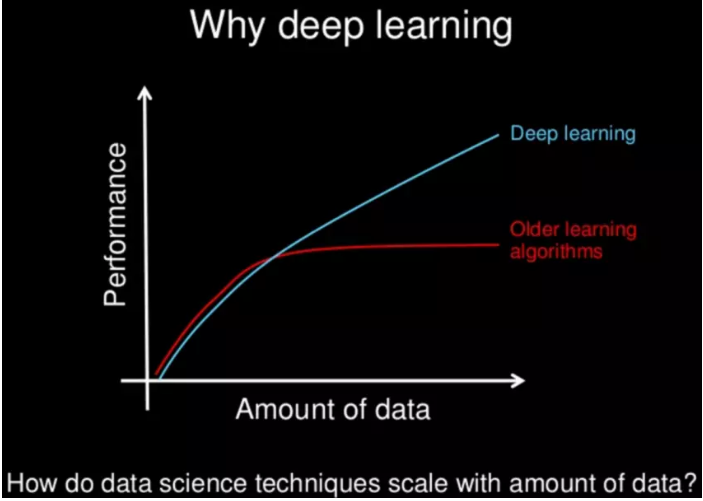

# 机器学习与深度学习

机器学习是一类算法的总称，这些算法企图从大量历史数据中挖掘出其中隐含的规律，并用于预测或者分类，更具体的说，机器学习可以看作是寻找一个函数，输入是样本数据，输出是期望的结果，只是这个函数过于复杂，以至于不太方便形式化表达。

### 机器学习算法

按学习过程：

- 无监督学习

  - 是指人们在获得训练的向量数据后在没有标签的情况下尝试找出其内部蕴含关系的一种挖掘工作，这个过程中使用者除了可能要设置一些必要的超参数（hyper-parameter）以外，不用对这些样本做任何的标记甚至是过程干预
- 监督学习

  - 每一个样本都有着明确的标签，最后我们只是要总结出这些训练样本向量与标签的映射关系

    
- 半监督学习

按算法种类分类：

- 聚类

  - 聚类（clustering）是一种典型的“无监督学习”，是把物理对象或抽象对象的集合分组为由彼此类似的对象组成的多个类的分析过程
  - 比较常用的聚类算法有K-Means、DBSCAN等几种，基本思路都是利用每个向量之间的“距离”——空间中的欧氏距离或者曼哈顿距离，从远近判断是否从属于同一类别

- 回归

  - 回归是一种解题方法，或者说“学习”方法，也是机器学习中比较重要的内容

  - 当我看到大量的事实所呈现的样态，我推断出原因或客观蕴含的关系是如何的；当我看到大量的观测而来的向量（数字）是某种样态，我设计一种假说来描述它们之间蕴含的关系是如何的

  - 在机器学习领域，最常用的回归有两大类——一类是线性回归，一类是非线性回归
    $$
    y=f（x）=wx+b
    $$
    

    

- 分类

  - 分类是机器学习中使用的最多的一大类算法，我们通常也喜欢把分类算法叫做“分类器”

### 深度学习

深度学习（DL）是机器学习中一种基于对数据进行表征学习的方法，是一种能够模拟出人脑的神经结构的机器学习方法。深度学习的概念源于人工神经网络的研究。而人工神经网络ANN（Ar[TI](http://bbs.elecfans.com/zhuti_715_1.html)ficial Neural Network）是从信息处理角度对人脑神经元网络进行抽象，建立某种简单模型，按不同的连接方式组成不同的网络，简称为神经网络或类神经网络。因此，深度学习又叫深层神经网络DNN（Deep Neural Networks），是从之前的人工神经网络ANN模型发展而来的。

**与传统机器学习算法的对比：**

**深度学习为什么这么强？**

- 不用提取特质
  - 在以往我们使用的朴素贝叶斯、决策树、支持向量机SVM这些分类器模型中，提取特征是一个非常重要的前置工作
- 处理线性不可分
  - 就是用大量的线性分类器的堆叠使得整个模型可以将线性不可分的问题变得可分

### **But**

**什么时候不需要：**

- 低预算或低投资问题
- 解释和传达模型参数或特征对一般受众的重要性
- 建立因果机制
- 学习非结构化特征
