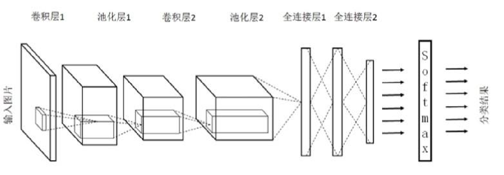
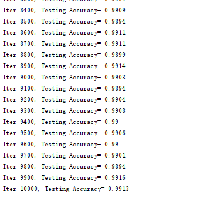

# 图像分类与CNN

传统神经网络存在的问题：

- 权值太多，计算量大
- 需要大量的样本进行训练


### 局部感受野

> 1962年哈佛医学院神经生理学家Hubel和Wiesel通过对猫视觉皮层细胞的研究，提出了感受野
> (receptive field)的概念，1984年日本学者Fukushima基于感受野概念提出的神经认知机
> (neocognitron)可以看作是卷积神经网络的第一个实现网络，也是感受野概念在人工神经网络领
> 域的首次应用 


### 卷积


### 卷积网络结构



### 应用

#### 用CNN实现MNIST分类

```
tensorboard --logdir=G:\02_workspace\33_git_open\opencv_tf_py\datas\logs\share\mnist\cnn\projector\projector --host=127.0.0.1
```



##### Inception

2012年AlexNet做出历史突破以来，直到GoogLeNet出来之前，主流的网络结构突破大致是网络更深（层数），但是纯粹的增大网络的缺点：

1. 参数太多，容易过拟合；
2. 网络越大计算复杂度越大，难以应用；
3. 网络越深，梯度越往后穿越容易消失（梯度弥散），难以优化模型。

Inception就是在这样的情况下应运而生，并且Inception 网络是 CNN 分类器发展史上一个重要的里程碑。

Inception 网络是复杂的（需要大量工程工作）。它的不断进化带来了多种 Inception 网络版本的出现。常见的版本有：

- Inception v1
- Inception v2 
- Inception v3
- Inception v4 
- Inception-ResNet

```
tensorboard --logdir=G:\02_workspace\33_git_open\opencv_tf_py\datas\logs\share\inception --host=127.0.0.1
```

### 迁移学习

> 所谓迁移学习是指针对新问题重新使用预先训练的模型。由于它能用较少的数据训练深度神经网络，这使得目前它在深度学习领域非常流行。

#### 解决的问题

- 小数据问题
- 个性化问题

#### 迁移方法

样本迁移


特征迁移


模型迁移


[tesnorflow模型](https://github.com/tensorflow/models)

关系迁移


#### 迁移实践

##### 1.用Inception模型实现自己的图像分类

[VGG数据集](http://www.robots.ox.ac.uk/~vgg/data/)

##### 2.使用facenet实现人脸识别


> FaceNet的总体流程为：输入图像通过由Inception-v4作为Feature Encoder的模型产生128-d的输出向量，通过L2 regularization后得到128-d Face Embedding vectors，选择有效的Anchor-Positive Pairs和Anchor-Negative Pairs计算得到Triplet Loss，并利用SGD对Feature Encoder的网络参数进行更新，最终训练得到的是输入人脸图像到人脸的128-d编码的脸部特征向量的脸部特征编码器(而不是人脸分类器)，MAP(Xim)→128-d embedding，最终利用NN(最近邻)计算128-d embedding相似度(文中采用欧式距离作为相似度)得到人脸的身份信息，若相似度超过某个阈值，则认为是未知用户。

#### 相关链接

https://www.betaface.com/wpa/

http://how-old.net/