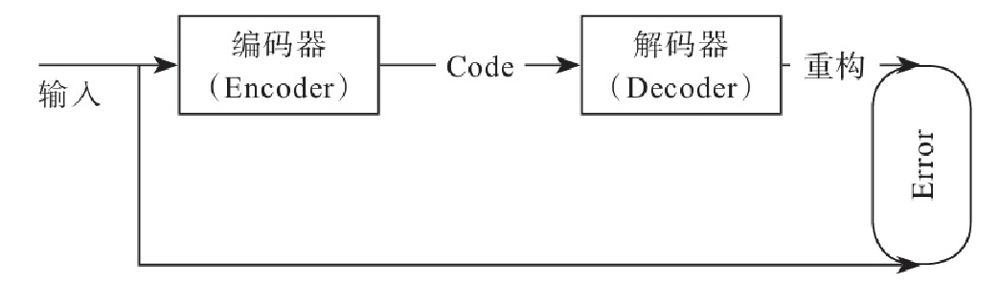

# 自编码器

自编码器(Autoencoder，简称为AE)是一种无监督的神经网络，顾名思义，它可以使用自身的高阶特征编码自己。它的输入和输出是一致的，但不是简单复制自己，而是使用一些高阶特征重新组合来构建自己。其核心功能是能够学习到输入数据的深层或更高级的表示。具体来说，它可用于一些较难训练的神经网络权重初始化，使其权重值位于一个比较好的位置，有助于防止梯度消失问题的解决。不过，目前深度学习对一些较难训练的神经网络，一般采用其他算法或模型，如BN、深度残差神经网络等。自编码器可用于特征的抽取或降维等，其应用非常广泛。

**MNIST数据集恢复**

