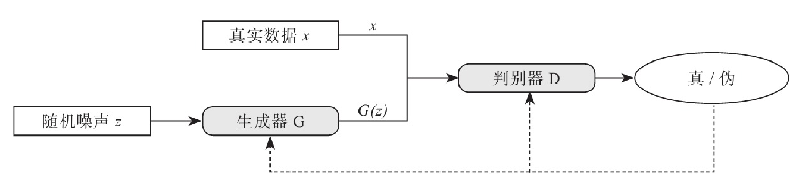
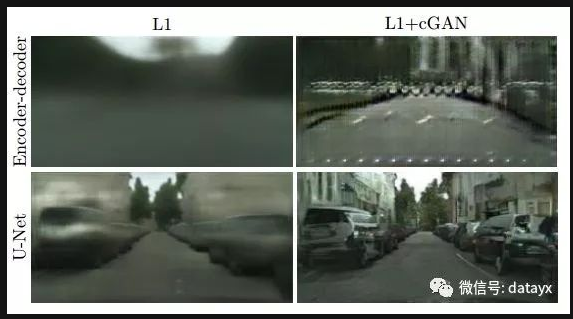
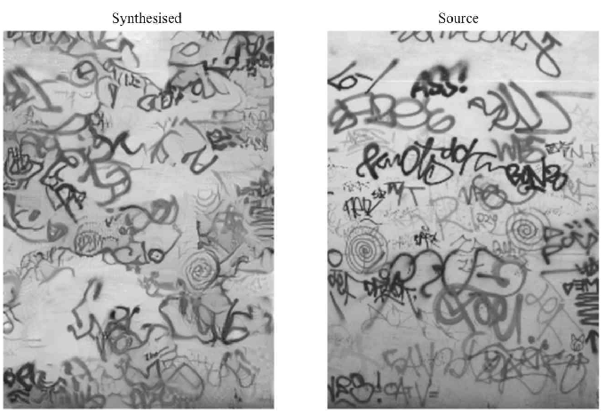
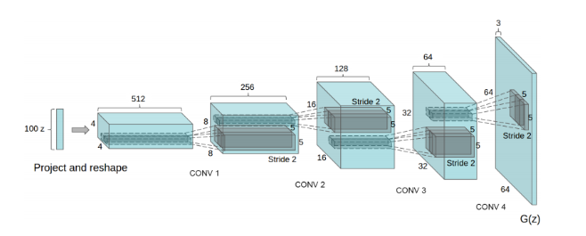
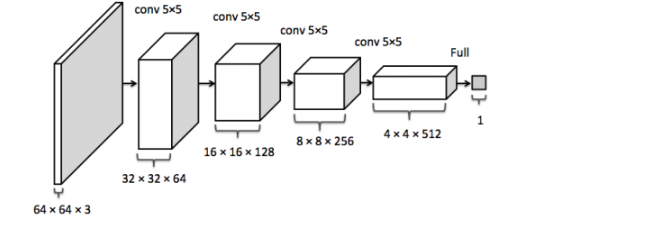

# 生成对抗网络

生成式对抗网络(Generative adversarial nets，GAN)，它是2014年由Ian Goodfellow提出的，它要解决的问题是如何从训练样本中学习出新样本，训练样本是图片就生成新图片，训练样本是文章就输出新文章。GAN既不依赖于标签来优化，也不根据对结果奖惩来调整参数。它是依据生成器和判别器之间的博弈来不断优化的。

https://github.com/Newmu/dcgan_code

https://mp.weixin.qq.com/s?__biz=MjM5OTA1MDUyMA==&mid=2655444570&idx=1&sn=88e61d011f01cafded6a1131911acc78&chksm=bd73122d8a049b3bd3ed85eb11d0bb9e42f58d96db22e2c9aa6a0bb6d37f9d7ceb94a5c7f2b1&scene=21#wechat_redirect

### 人脸生成

**GANs 模型**

- generator 网络：五层网络，采用反卷积，从 100 维的 z 信号生成人脸图片，网络结构见下图：

  

- discriminator 网络：是一个五层的判别网络，网络结构见下图：

