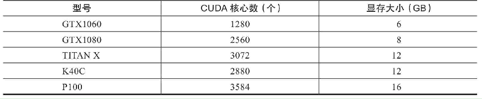

# GPU

### 为什么要用GPU？

以一个小规模的全连接网络为例，假设有5层，每层10个节点，输入向量有1000维，最后一层是SOFTMAX层。那么这个网络中一共有多少个权值需要被训练出来呢？

第一层就是10×1000个，第二层、第三层、第四层都是10×10，第五层是10×1个，这样加起来一共是10000+300+10=10310个维度。假设在训练的过程中平均每次在一个维度上挪动0.001来做一次迭代，挪动2000次恰好挪动到“合适”的位置，那么需要挪动多少次呢？用乘法算一下应该是20620000次。在一个独立的进程中，一次挪动和下一次挪动之间是串行的，也就是说需要一共等待2062万次的挪动时间才能完成这个训练，而且这个挪动毫无疑问是包含导数计算的时间的。可是如果有10个CPU内核，那就可以有10个进程来处理这个过程，每个CPU内核处理其中的权值更新即可，这个迭代的速度理论上可以提高10倍。

### 名词解释

- Graphic Processing Unit（GPU）：用于个人计算机、工作站和服务器的专用图像设备。又名显示卡或显卡，目前主要的生产厂商是NVIDA生产的N卡和AMD 生产的A卡。相比于由几个核组成CPU专注于顺序串行处理，GPU 则拥有一个由数以千计的更小、更高效的核组成的大规模并行计算架构，其更擅长并行计算。
- Compute Unified Device Architecture（CUDA）：它是NVIDIA推出的能够解决GPU复杂计算问题的并行计算架构。目前NVIDIA面向分布式计算的显卡架构的演变已经历了Tesla、Fermi、Kepler、Maxwell、Pascal、Volta（以物理学家名字命名），且随着架构的演变其浮点计算的能力也越来越强。在NVIDIA Tesla常以第一个字母来命名其产品，比如Tesla M40、Tesla P100、Tesla V100。
- CUDA Toolkit：CUDA Toolkit是为创建高性能GPU加速应用程序提供了开发环境。目前支持C，C ++，Fortran，Python和MATLAB的编程，编译器的名称是nvcc。
- NVIDIA GPU drivers（显卡驱动）：它是用来驱动NVIDIA显卡所对应的软件程序。
- CUDA Deep Neural Network Library（cuDNN）：NVIDIA打造的针对深度神经网络的加速库，是一个用于深层神经网络的GPU加速库。如果你要用GPU训练模型，cuDNN不是必须的，但是一般会采用这个加速库。

### 使用

现在业界比较成熟的是使用英伟达（NVIDIA）提供的解决方案，一种在显卡GPU中使用的并行计算单元——CUDA（Compute Unified Device Architecture）。在一块带有CUDA功能的显卡中，带有数以千计的CUDA内核（相当于CPU内核），见下表：

从TensorFlow 所需要软件CUDA和CUDA的名词描述可以得出TensorFlow仅仅支持N卡，如果计算机属于A卡，则只能安装TensorFlow CPU版本，或者用AMD的ROCm GPU平台来安装GPU 版本的TensorFlow。

##### ROCm VS. CUDA

ROCm 的目标是建立可替代 CUDA 的生态，并在源码级别上对 CUDA 程序的支持。

##### 多路多卡支持

http://www.nvidia.cn/object/where-to-buy-tesla-cn.html