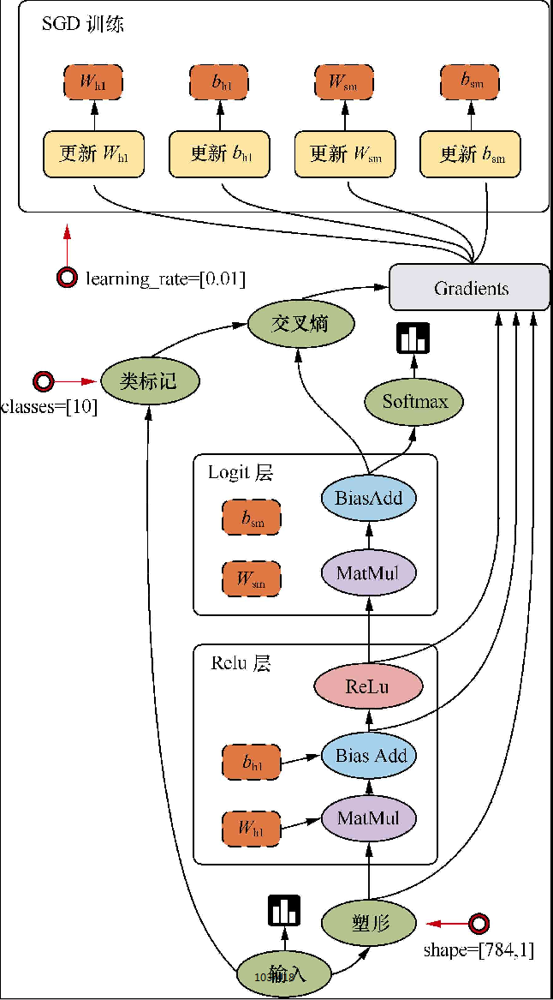

# Tensorflow模型与概念

### 系统架构


**设计理念：**

- 将图的定义和图的运行完全分开
- TensorFlow中涉及的运算都要放在图中，而图的运行只发生在会话（session）中

### 编程模型

TensorFlow是用数据流图做计算的，因此我们先创建一个数据流图（也称为网络结构图）



#### 边

TensorFlow的边有两种连接关系：数据依赖和控制依赖。其中，实线边表示数据依赖，代表数据，即张量（tensor）。任意维度的数据统称为张量。在机器学习算法中，张量在数据流图中从前往后流动一遍就完成了一次前向传播（forword propagation），而残差从后向前流动一遍就完成了一次反向传播（backword propagation）

#### 节点

图中的节点又称为算子，它代表一个操作（operation，OP），一般用来表示施加的数学运算，也可以表示数据输入（feed in）的起点以及输出（push out）的终点，或者是读取/写入持久变量（persistent variable）的终点

其他：

- 图
- 会话
- 设备
- 变量
- 常量
- 内核
- 作用域
- API
- ...


### 主要依赖包

TensorFlow依赖的两个最主要的工具包——Protocol Buffer和Bazel

#### Protocol Buffer

- Protocol Buffer是谷歌开发的处理结构化数据的工具是谷歌开发的处理结构化数据的工具。
- Protocol Buffer是TensorFlow系统中使用到的重要工具，TensorFlow中的数据基本都是通过Protocol Buffer来组织的。
- 分布式TensorFlow的通信协议gRPC也是以Protocol Buffer作为基础的。

#### Bazel

Bazel是从谷歌开源的自动化构建工具，谷歌内部绝大部分的应用都是通过它来编译的。相比传统的Makefile、Ant或者Maven,Bazel在速度、可伸缩性、灵活性以及对不同程序语言和平台的支持上都要更加出色。TensorFlow本身以及谷歌给出的很多官方样例都是通过Bazel来编译的。

### 可视化工具

#### PlayGround

PlayGround是一个用于教学目的的简单神经网络的在线演示、实验的图形化平台，非常强大地可视化了神经网络的训练过程。使用它可以在浏览器里训练神经网络，对Tensorflow有一个感性的认识。

#### TensorBoard

TensorBoard是TensorFlow自带的一个强大的可视化工具，也是一个Web应用程序套件。TensorBoard目前支持7种可视化，即SCALARS、IMAGES、AUDIO、GRAPHS、DISTRIBUTIONS、HISTOGRAMS和EMBEDDINGS。

这7种可视化的主要功能如下：

- SCALARS：展示训练过程中的准确率、损失值、权重/偏置的变化情况。
- IMAGES：展示训练过程中记录的图像。
- AUDIO：展示训练过程中记录的音频。
- GRAPHS：展示模型的数据流图，以及训练在各个设备上消耗的内存和时间。
- DISTRIBUTIONS：展示训练过程中记录的数据的分布图。
- HISTOGRAMS：展示训练过程中记录的数据的柱状图。
- EMBEDDINGS：展示词向量（如Word2vec）后的投影分布

TensorBoard通过运行一个本地服务器，来监听6006端口。在浏览器发出请求时，分析训练时记录的数据，绘制训练过程中的图像。

##### 例：手写数字识别(MNIST)

启动一个全连接神经网络

```shell
tensorboard --logdir=G:\02_workspace\33_git_open\opencv_tf_py\datas\logs\share\mnist\fc\projector\projector --host=127.0.0.1
```


