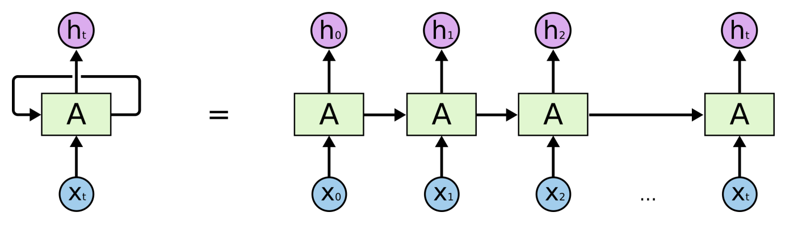
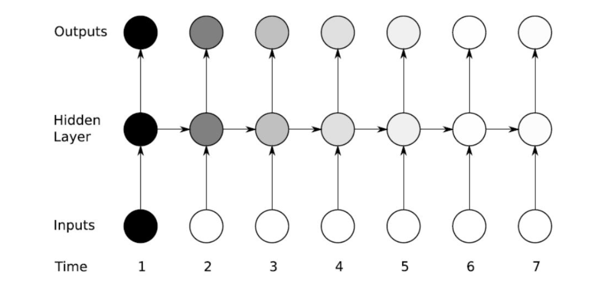
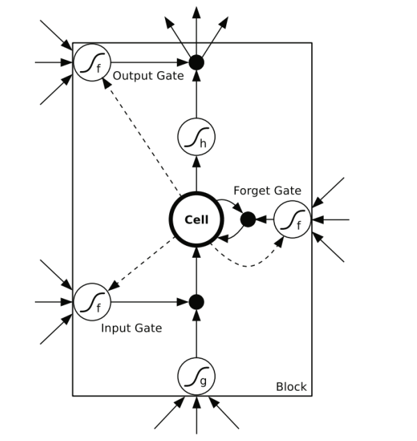
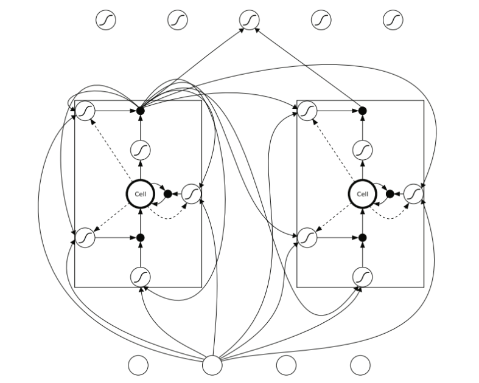
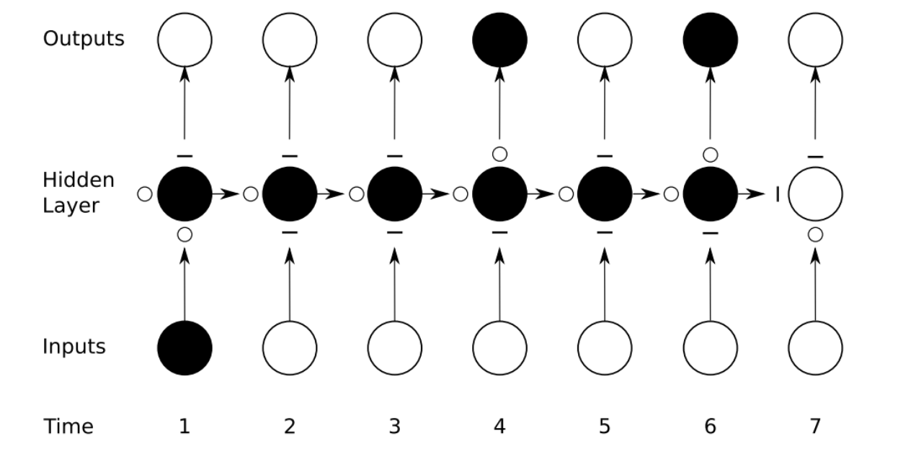
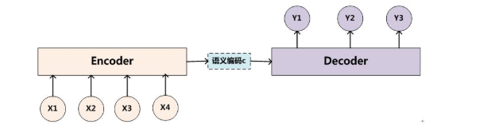
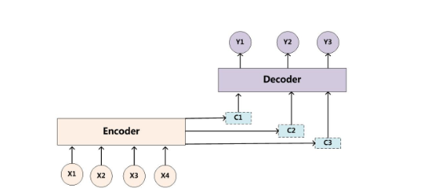

# 自然语言处理与RNN

> 天前山水上，人外日阳秋。
>
> 水水风吹起，山声日未曛。
>
> 风流春水急，江上楚帆迟。
>
> 更到江湖水，春时入客舟。

循环神经网络（recurrent neural network,RNN）源自于1982年由Saratha Sathasivam提出的霍普菲尔德网络。霍普菲尔德网络因为实现困难，在其提出时并且没有被合适地应用。该网络结构也于1986年后被全连接神经网络以及一些传统的机器学习算法所取代。然而，传统的机器学习算法非常依赖于人工提取的特征，使得基于传统机器学习的图像识别、语音识别以及自然语言处理等问题存在特征提取的瓶颈。而基于全连接神经网络的方法也存在参数太多、无法利用数据中时间序列信息等问题。随着更加有效的循环神经网络结构被不断提出，循环神经网络挖掘数据中的时序信息以及语义信息的深度表达能力被充分利用，并在语音识别、语言模型、机器翻译以及时序分析等方面实现了突破。

循环神经网络的主要用途是处理和预测序列数据。

存在问题：记忆衰退

#### LSTM(long short-term memory)

#### 聊天机器人

- 第一代是基于特征工程。有大量的逻辑判断，如if then; else then。

- 第二代是基于检索库。给定一个问题或者聊天，从检索库中找到与已有答案最匹配的答案。

- 第三代是基于深度学习。采用[seq2seq+Attention](https://cloud.tencent.com/developer/news/372017)模型，经过大量的训练，根据输入生成相应的输出。

  

  
