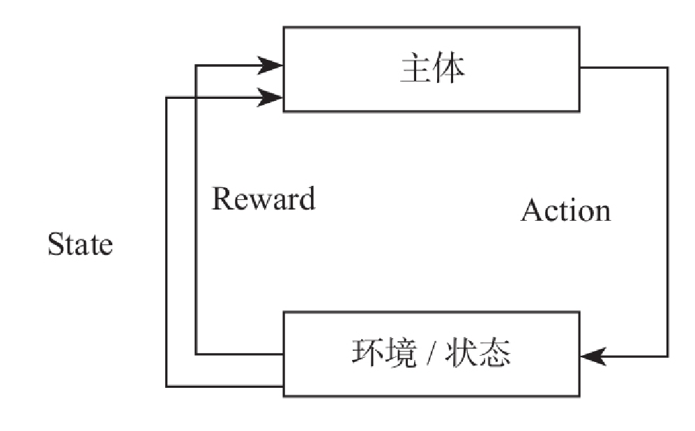

# 强化学习与宽度学习

### 强化学习

强化学习是机器学习中的一种算法，它不像监督学习或无监督学习有大量的经验或输入数据，而是让计算机实现从一开始什么都不懂，最终自学成才。它通过不断地尝试，从错误或惩罚中学习，最后找到规律，学会达到目的的方法。这就是一个完整的强化学习过程。

强化学习应用非常广泛，目前主要领域有：

- 游戏理论与多主体交互;
- 机器人；
- 电脑网络；
- 车载导航；
- 医学；
- 工业物流

### 宽度学习

宽度学习系统（BLS） 一词的提出源于澳门大学科技学院院长陈俊龙和其学生于2018年1月发表在IEEE TRANSACTIONS ON NEURAL NETWORKS AND LEARNING SYSTEMS，VOL. 29, NO. 1 的一篇文章，题目叫《Broad Learning System: An Effective and Efficient Incremental Learning System Without the Need for Deep Architecture 》。文章的主旨十分明显，就是提出了一种可以和[深度学习](http://www.dataguru.cn/article-9400-1.html?union_site=innerlink)媲美的宽度学习框架。

宽度网络的实质是一种**随机向量函数链接神经网络（random vector functional link neural network，RVFLNN）**

相对于“深度”结构来说，“宽度”结构由于没有层与层之间的耦合而非常简洁。同样，由于没有多层连接，宽度网络亦不需要利用梯度下降来更新权值，所以计算速度大大优于深度学习。在网络精度达不到要求时，可以通过增加网络的“宽度”来提升精度，而增加宽度所增加的计算量和深度网络增加层数相比，可以说是微乎其微。

宽度学习适用于**数据特征不多但对预测实时性要求较高的系统。**也就说**，**该结构在类似ImageNet的大型图像分类问题上表现并不是很好，这也是为什么只有**MNIST和NORB**数据集实验结果的原因。